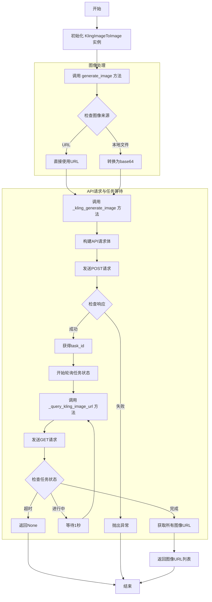

# 可灵 Kling 图生图

这是一个图生图的示例，使用 kling 生成图像。

> [!TIP]
> 图像生成是计算密集型任务，特别是高质量、高分辨率图像可能需要数十秒甚至数分钟处理时间，为了让用户发送请求后可以立即收到响应（任务ID），而不必等待整个生成过程，因此用户可以同时提交多个生成任务，然后异步查询结果。
> 同时这样的队列系统允许服务提供商根据可用GPU/TPU资源智能调度任务。

通常来说，图像生成的常见流程是：

1. `POST`: 调用 `生成图像api` 提交图像生成任务，返回获取 `task_id`。
2. `GET`: 根据 `task_id` 调用 `查询图像api` 查看图像生成任务是否完成。

本示例实现了每隔一秒轮询任务状态，直到任务完成，然后返回图像 url 列表。

## 代码示例

> 深色背景为可以修改的参数，非必选参数已经注释，可以按照自己的需求启用。


<<< @/zh/snippets/kling-image-to-image.py{164-165,172-182}


## 返回结果

返回结果为图片的 url 列表，这里使用参数 `n=2` 生成两张图片，每个 url 有效期一般为 30 天，推荐尽快下载或者转存。

```
['https://cdn.klingai.com/bs2/upload-kling-api/6567899185/image/CjikY2gHPbcAAAAABUWVOA-0_raw_image_1.png', 'https://cdn.klingai.com/bs2/upload-kling-api/6567899185/image/CjikY2gHPbcAAAAABUWVOA-1_raw_image_1.png']
```


## 流程图

