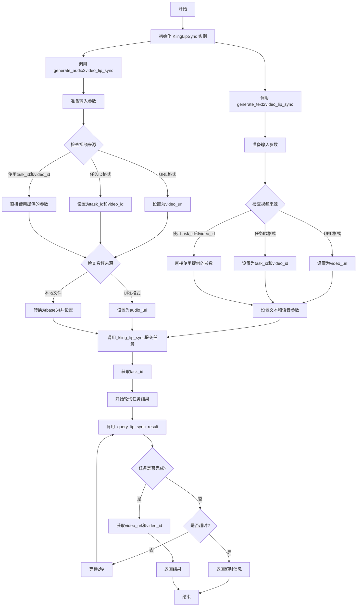

# 可灵 Kling 视频口型同步

这是一个视频口型同步的示例，使用 kling 口型同步视频。

> [!TIP]
> 视频口型同步是计算密集型任务，特别是高质量、高分辨率视频可能需要数十秒甚至数分钟处理时间，为了让用户发送请求后可以立即收到响应（任务ID），而不必等待整个生成过程，因此用户可以同时提交多个生成任务，然后异步查询结果。
> 同时这样的队列系统允许服务提供商根据可用GPU/TPU资源智能调度任务。

通常来说，视频口型同步的常见流程是：

1. `POST`: 调用 `视频口型同步api` 提交视频口型同步任务，返回获取 `task_id`。
2. `GET`: 根据 `task_id` 调用 `查询视频api` 查看视频口型同步任务是否完成。

本示例实现了每隔一秒轮询任务状态，直到任务完成，然后返回视频 url 和 id。

## 代码示例

> 深色背景为可以修改的参数，非必选参数已经注释，可以按照自己的需求启用。


<<< @/zh/snippets/kling-lip-sync.py{247-248,255-262,270-272,277-278,283-285}


## 返回结果

返回结果为视频的 url 和 id，视频的有效期一般为 30 天，推荐尽快下载或者转存。

```

```

## 流程图

